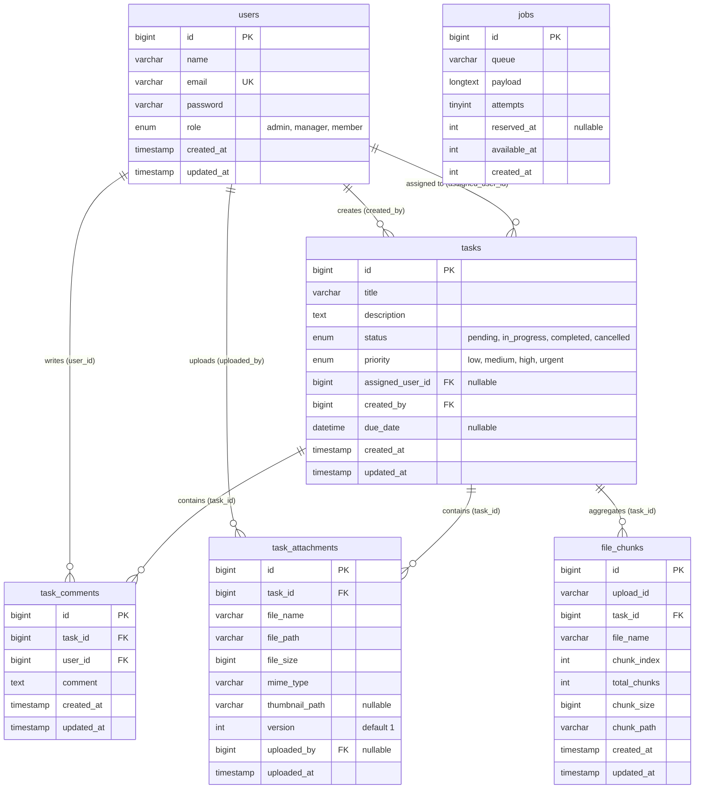

# Database Schema Documentation

## 1. Overview & Architecture

The database architecture for the Task Management Platform is designed to support high-throughput RESTful operations, relational integrity across collaborative entities, large chunked file uploads, and resilient background job queues.

The database is fully supported on **MySQL 8.0+ / MariaDB 10.4+** and **SQLite 3.35+** for local zero-configuration development and automated testing.

---

## 2. Entity-Relationship Diagram (ERD)

---

## 3. Data Dictionary & Table Definitions

### 3.1 `users` Table

Stores system accounts, credential hashes, and RBAC authorization roles.

| Column | Data Type | Nullable | Default | Description |
| --- | --- | --- | --- | --- |
| `id` | `BIGINT UNSIGNED` | No | Auto Increment | Primary Key |
| `name` | `VARCHAR(255)` | No | — | User's full display name |
| `email` | `VARCHAR(255)` | No | — | Unique login email address (Indexed) |
| `password` | `VARCHAR(255)` | No | — | Bcrypt hashed password |
| `role` | `ENUM` | No | `'member'` | `admin`, `manager`, `member` |
| `remember_token` | `VARCHAR(100)` | Yes | `NULL` | Session remember token |
| `created_at` | `TIMESTAMP` | Yes | `CURRENT_TIMESTAMP` | Account creation timestamp |
| `updated_at` | `TIMESTAMP` | Yes | `CURRENT_TIMESTAMP` | Last profile update timestamp |

**Indexes & Keys:**
- `PRIMARY KEY (id)`
- `UNIQUE KEY users_email_unique (email)`

---

### 3.2 `tasks` Table

Core entity representing assigned work items, their progression states, and priorities.

| Column | Data Type | Nullable | Default | Description |
| --- | --- | --- | --- | --- |
| `id` | `BIGINT UNSIGNED` | No | Auto Increment | Primary Key |
| `title` | `VARCHAR(255)` | No | — | Task title / headline |
| `description` | `TEXT` | Yes | `NULL` | Detailed task instructions or markdown notes |
| `status` | `ENUM` | No | `'pending'` | `'pending'`, `'in_progress'`, `'completed'`, `'cancelled'` |
| `priority` | `ENUM` | No | `'medium'` | `'low'`, `'medium'`, `'high'`, `'urgent'` |
| `assigned_user_id` | `BIGINT UNSIGNED` | Yes | `NULL` | Foreign key referencing `users.id` |
| `created_by` | `BIGINT UNSIGNED` | No | — | Foreign key referencing `users.id` |
| `due_date` | `DATETIME` | Yes | `NULL` | Task target completion deadline |
| `created_at` | `TIMESTAMP` | Yes | `CURRENT_TIMESTAMP` | Creation timestamp |
| `updated_at` | `TIMESTAMP` | Yes | `CURRENT_TIMESTAMP` | Last updated timestamp |

**Indexes & Keys:**
- `PRIMARY KEY (id)`
- `KEY tasks_status_index (status)`: Fast filtering by state.
- `KEY tasks_priority_index (priority)`: Fast filtering by urgency.
- `KEY tasks_assigned_user_id_index (assigned_user_id)`: Fast retrieval of "my tasks".
- `KEY tasks_created_by_index (created_by)`: Fast retrieval of created tasks.
- `KEY tasks_due_date_index (due_date)`: Fast sorting by upcoming deadlines.
- `KEY tasks_status_priority_index (status, priority)`: Compound index for multi-facet filter queries.
- `FOREIGN KEY (assigned_user_id) REFERENCES users(id) ON DELETE SET NULL`
- `FOREIGN KEY (created_by) REFERENCES users(id) ON DELETE CASCADE`

---

### 3.3 `task_attachments` Table

Records uploaded attachments (documents, images, videos) associated with a task.

| Column | Data Type | Nullable | Default | Description |
| --- | --- | --- | --- | --- |
| `id` | `BIGINT UNSIGNED` | No | Auto Increment | Primary Key |
| `task_id` | `BIGINT UNSIGNED` | No | — | Foreign key referencing `tasks.id` |
| `file_name` | `VARCHAR(255)` | No | — | Original uploaded file name |
| `file_path` | `VARCHAR(500)` | No | — | Relative storage path (`storage/uploads/...`) |
| `file_size` | `BIGINT UNSIGNED` | No | — | Exact file size in bytes |
| `mime_type` | `VARCHAR(100)` | No | — | Inspected MIME type (e.g., `image/png`, `video/mp4`) |
| `thumbnail_path` | `VARCHAR(500)` | Yes | `NULL` | Generated thumbnail path (for images/videos) |
| `version` | `INT UNSIGNED` | No | `1` | Automatic incremental version number |
| `uploaded_by` | `BIGINT UNSIGNED` | Yes | `NULL` | Foreign key referencing `users.id` |
| `uploaded_at` | `TIMESTAMP` | Yes | `CURRENT_TIMESTAMP` | Upload timestamp |

**Indexes & Keys:**
- `PRIMARY KEY (id)`
- `KEY task_attachments_task_id_index (task_id)`
- `KEY task_attachments_task_file_version_index (task_id, file_name, version)`: Instant version resolution.
- `FOREIGN KEY (task_id) REFERENCES tasks(id) ON DELETE CASCADE`
- `FOREIGN KEY (uploaded_by) REFERENCES users(id) ON DELETE SET NULL`

---

### 3.4 `task_comments` Table

Collaboration thread for tasks, allowing team members to communicate.

| Column | Data Type | Nullable | Default | Description |
| --- | --- | --- | --- | --- |
| `id` | `BIGINT UNSIGNED` | No | Auto Increment | Primary Key |
| `task_id` | `BIGINT UNSIGNED` | No | — | Foreign key referencing `tasks.id` |
| `user_id` | `BIGINT UNSIGNED` | No | — | Foreign key referencing `users.id` |
| `comment` | `TEXT` | No | — | Comment content body |
| `created_at` | `TIMESTAMP` | Yes | `CURRENT_TIMESTAMP` | Creation timestamp |
| `updated_at` | `TIMESTAMP` | Yes | `CURRENT_TIMESTAMP` | Last updated timestamp |

**Indexes & Keys:**
- `PRIMARY KEY (id)`
- `KEY task_comments_task_id_index (task_id)`
- `KEY task_comments_user_id_index (user_id)`
- `FOREIGN KEY (task_id) REFERENCES tasks(id) ON DELETE CASCADE`
- `FOREIGN KEY (user_id) REFERENCES users(id) ON DELETE CASCADE`

---

### 3.5 `file_chunks` Table

Temporary state table for chunked upload sessions (>50MB files).

| Column | Data Type | Nullable | Default | Description |
| --- | --- | --- | --- | --- |
| `id` | `BIGINT UNSIGNED` | No | Auto Increment | Primary Key |
| `upload_id` | `VARCHAR(100)` | No | — | Unique upload session identifier |
| `task_id` | `BIGINT UNSIGNED` | No | — | Target task ID |
| `file_name` | `VARCHAR(255)` | No | — | Original file name |
| `chunk_index` | `INT UNSIGNED` | No | — | 0-based sequential chunk slice index |
| `total_chunks` | `INT UNSIGNED` | No | — | Total number of chunks expected |
| `chunk_size` | `BIGINT UNSIGNED` | No | — | Slice size in bytes |
| `chunk_path` | `VARCHAR(500)` | No | — | Temporary filesystem slice path |
| `created_at` | `TIMESTAMP` | Yes | `CURRENT_TIMESTAMP` | Chunk arrival timestamp |
| `updated_at` | `TIMESTAMP` | Yes | `CURRENT_TIMESTAMP` | Last updated timestamp |

**Indexes & Keys:**
- `PRIMARY KEY (id)`
- `KEY file_chunks_upload_id_index (upload_id)`
- `UNIQUE KEY file_chunks_upload_chunk_unique (upload_id, chunk_index)`

---

### 3.6 `jobs` Table (Database Queue Worker)

Durable asynchronous job queue storage.

| Column | Data Type | Nullable | Default | Description |
| --- | --- | --- | --- | --- |
| `id` | `BIGINT UNSIGNED` | No | Auto Increment | Primary Key |
| `queue` | `VARCHAR(255)` | No | `'default'` | Queue destination name |
| `payload` | `LONGTEXT` | No | — | Serialized job class, data, and parameters |
| `attempts` | `TINYINT UNSIGNED` | No | `0` | Number of execution attempts |
| `reserved_at` | `INT UNSIGNED` | Yes | `NULL` | UNIX timestamp when worker locked the job |
| `available_at` | `INT UNSIGNED` | No | — | UNIX timestamp when job becomes runnable |
| `created_at` | `INT UNSIGNED` | No | — | UNIX timestamp when job was enqueued |

**Indexes & Keys:**
- `PRIMARY KEY (id)`
- `KEY jobs_queue_index (queue)`

---

## 4. Referential Integrity & Cascade Deletion Rules

1. **When a `Task` is deleted**:
   - All associated `task_comments` are automatically removed (`ON DELETE CASCADE`).
   - All associated `task_attachments` records are removed (`ON DELETE CASCADE`), and their files on disk are cleaned up.
   - Any in-flight `file_chunks` are cleaned up.
2. **When a `User` is deleted**:
   - Tasks created by the user are purged (`ON DELETE CASCADE`).
   - Tasks assigned to the user have their `assigned_user_id` set to `NULL` (`ON DELETE SET NULL`) so work is not lost.
   - Comments written by the user are removed (`ON DELETE CASCADE`).
   - Uploaded attachments have `uploaded_by` set to `NULL` (`ON DELETE SET NULL`).

---

## 5. Migration & Seeding Procedures

- **SQL Schema File**: [`backend/database/schema.sql`](file:///d:/test/trans-cosmos/backend/database/schema.sql)
- **Seed Data File**: [`backend/database/seeds.sql`](file:///d:/test/trans-cosmos/backend/database/seeds.sql)
- **Complete Unified Dump**: [`backend/database/dump.sql`](file:///d:/test/trans-cosmos/backend/database/dump.sql)
- **Laravel Migrations**: [`backend/database/migrations/`](file:///d:/test/trans-cosmos/backend/database/migrations/)
- **Laravel Database Seeder**: [`backend/database/seeders/DatabaseSeeder.php`](file:///d:/test/trans-cosmos/backend/database/seeders/DatabaseSeeder.php)
