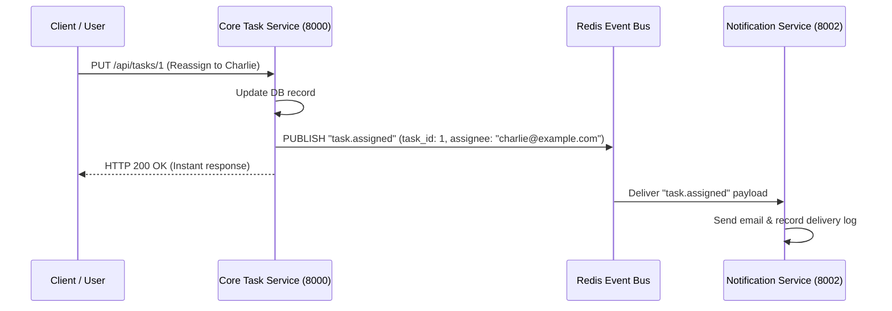

# Task Management Platform - Microservices Architecture Documentation

## 1. Executive Summary & Domain Decomposition

To scale beyond a monolithic architecture, CPU-intensive file processing, threat scanning, and outbound notifications have been decoupled into **independent, containerized microservices** adhering to Domain-Driven Design (DDD) principles.

```
                                  [ Internet / Clients ]
                                             │
                                             ▼
                                  [ API Gateway / Nginx ]
                                             │
                 ┌───────────────────────────┼───────────────────────────┐
                 │                           │                           │
                 ▼                           ▼                           ▼
       [ Core Task Service ]      [ Media Processor ]       [ Notification Service ]
       (Port 8000 - Laravel)      (Port 8001 - Node)         (Port 8002 - Node)
                 │                           │                           │
                 ├─────────► [ Redis Event Bus & Distributed Cache ] ◄───┤
                 │                           │                           │
                 ▼                           ▼                           ▼
        [ MySQL Database ]          [ Shared S3/Storage ]        [ Webhook / Email ]
```

---

## 2. Microservice Boundaries & Responsibilities

### 2.1 Service 1: Core Task API & Gateway Service (`backend/`)
- **Port**: `8000`
- **Domain**: Task Lifecycle, User Authentication, RBAC, Comments, Filter/Search Queries.
- **Data Store**: MySQL 8.0+ / SQLite.
- **Interactions**:
  - Issues JWT authentication tokens.
  - Delegates chunked media reassembly & threat scanning to **Media Processor**.
  - Dispatches assignment & comment events to **Notification Service**.

### 2.2 Service 2: Media Processor Microservice (`services/media-processor/`)
- **Port**: `8001`
- **Domain**: High-intensity binary processing, chunk slice reassembly, heuristic virus scanning, and thumbnail/video metadata extraction.
- **Endpoints**:
  - `GET /health`: Microservice health check & worker memory metrics.
  - `POST /api/v1/scan-threat`: Real-time inspection for EICAR, MZ/ELF executables, and script injection.
  - `POST /api/v1/process-media`: Reassembles chunks, verifies integrity, generates image/video thumbnails, and extracts resolution metadata.
- **Independence**: Can scale horizontally independently based on upload traffic without taxing the main web app.

### 2.3 Service 3: Notification & Event Dispatcher (`services/notification-service/`)
- **Port**: `8002`
- **Domain**: Transactional emails, push notifications, and external webhooks.
- **Endpoints**:
  - `GET /health`: Health status, delivery counters, and Dead Letter Queue (DLQ) depth.
  - `POST /api/v1/notify`: Ingests events (`task.assigned`, `comment.created`, etc.) and dispatches asynchronously.
  - `GET /api/v1/deliveries`: Delivery audit trail and status history.
- **Resilience**: Implements retry policies and routes unrecoverable failures into a Dead Letter Queue (DLQ).

---

## 3. Inter-Service Communication & Event Bus

### 3.1 Synchronous Communication (HTTP / REST)
Used when immediate transactional confirmation is required (e.g., synchronous threat scanning before accepting an uploaded file into storage):
- **Request**: `POST http://media-processor:8001/api/v1/scan-threat`
- **Tracing**: Propagates `X-Correlation-ID` header across all hops.

### 3.2 Asynchronous Event-Driven Messaging (Redis Pub/Sub & Queues)
Used for non-blocking workflows (e.g., notifying assignees or transcoding heavy video files):


---

## 4. Distributed Tracing with Correlation IDs

Every inbound request received at the API Gateway is assigned an `X-Correlation-ID` (UUIDv4) if not already provided by the client. This ID is passed downstream in all HTTP headers and log contexts:

```http
X-Correlation-ID: e8f5c3b2-9d41-4e78-831b-12d45a9071f3
X-Service: media-processor-service
X-Timestamp: 2026-09-27T13:15:30.000Z
```

Logs from all microservices can be aggregated into a central logging pipeline (e.g., ELK Stack / Grafana Loki) and queried using the single `X-Correlation-ID` to reconstruct the complete end-to-end request lifecycle.

---

## 5. Fault Tolerance & Resiliency Patterns

1. **Circuit Breaker**: If the Media Processor or Notification Service experiences consecutive timeouts, the Core Task Service trips the circuit and fails gracefully (e.g., queues the asset for later processing) rather than cascading thread exhaustion.
2. **Dead Letter Queue (DLQ)**: Failed notifications or webhook dispatches that exceed maximum retry attempts are placed in the DLQ for operator inspection without crashing the worker.
3. **Graceful Degradation**: If the Notification Service is temporarily unreachable, task creation and updates still succeed without interruption.

---

## 6. Microservices Orchestration (Docker Compose)

The full microservices stack is orchestrated via [`docker-compose.microservices.yml`](file:///d:/test/trans-cosmos/docker-compose.microservices.yml):

```bash
# Start all 6 containerized microservices:
docker compose -f docker-compose.microservices.yml up -d

# Verify health status of all services:
docker compose -f docker-compose.microservices.yml ps
```

Services started:
- `api-gateway`: `http://localhost:8000`
- `media-processor`: `http://localhost:8001`
- `notification-service`: `http://localhost:8002`
- `frontend`: `http://localhost:3000`
- `mysql`: `localhost:3306`
- `redis`: `localhost:6379`
